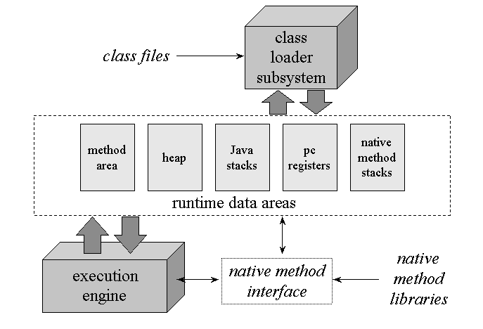
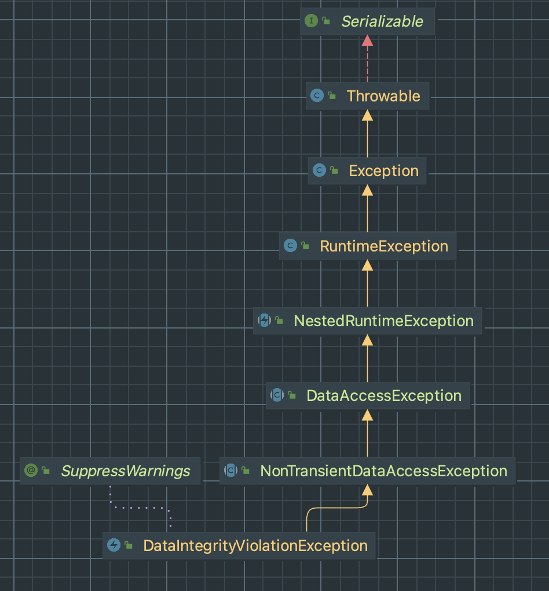
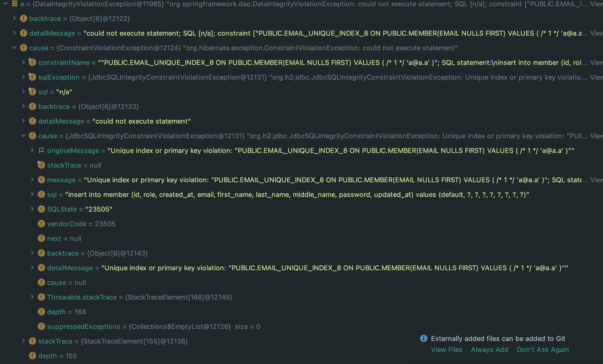

# Thread safe sign up

# 개선된 회원가입

## 목록

1. 문제 상황
2. 해결 과정
3. 해결 방법

## 1. 문제 상황

회원가입 기능은 매우 간단한 기능이고, 스프링을 처음 시작하신 분들도 만들 수 있는 기능입니다.

하지만 멀티쓰레드를 고려하지 않으면 실제 배포시 심각한 문제가 발생할 수 있습니다.

다음은 제가 맨 처음 작성한 코드입니다. 아래의 코드에서 문제점을 찾아보길 바랍니다.

```java
public Member doSignUp(SignUpRequest dto){
    //이미 가입된 이메일인지 체크
    if (memberRepository.existsByEmail(dto.getEmail())){
        throw new OccupiedEmailException(dto.getEmail());
    }
    //가입 처리
    Member member = Member.of(
            dto,
            passwordEncoder.encode(dto.getPassword()),
            Authority.ROLE_USER
    );
    return memberRepository.save(member);
}
```

위 코드는 쓰레드에 안전하지 않습니다. 아래의 예시를 봅시다.

### 예시

한 유저가 회원가입 요청을 빠르게 여러번 클릭해 보냈다고 가정합시다.

똑같은 회원가입 요청이 여러 쓰레드에 배정됩니다. (여기서는 두개의 쓰레드만 간추려서 논합니다.)

쓰레드 A와 B에 같은 요청이 배정되었습니다.

1. 쓰레드 A가 아래 코드를 통해 이메일이 있는지 확인합니다. → 가입된 적이 없는 이메일입니다.

```java
if (memberRepository.existsByEmail(dto.getEmail())){
    throw new OccupiedEmailException(dto.getEmail());
}
```

1. 쓰레드 B로 전환이 되고 쓰레드 B도 똑같이 위의 과정을 통해 이메일을 확인합니다. → 가입된 적이 없는 이메일입니다.
2. 쓰레드 A가 가입 처리로 DB에 INSERT문을 날립니다. → 성공
3. 쓰레드 B가 가입 처리로 DB에 INSERT문을 날립니다. → email은 unique 값이므로 데이터 무결성 위반

여기서는 간단하게 두 개의 쓰레드로만 진행을 하였지만, 실제로는 10개짜리 쓰레드 풀을 만들고 진행한 결과, 10개 모두 if문이 걸러내지 못하고 DB단에서 문제가 발생함을 볼 수 있었습니다.

## 2. 해결 과정

해결을 하기 위해 저 나름으로는 많은 공부와 생각이 필요했습니다.

아래에는 공부하거나 시도해보았던 것들을 최대한 **간단하게** 요약하겠습니다. 해결 결과만 원하시는 분들을 3. 해결결과로 가시면 됩니다.

### ⚠️ 쓰레드에 안전한 변수

간단하게 요약하면 JVM은



이러한 메모리 구조를 가지고 있다. 여기서 쓰레드와 관련해서 살펴보자면, 

- 모든 쓰레드가 공유해서 사용 (GC의 관리 대상)
    - heap
        - new 키워드로 생성된 객체와 배열이 생성되는 영역입니다.
    - 메서드 영역
        - 클래스 멤버 변수의 이름, 데이터 타입, 접근 제어자 정보와 같은 각종 필드 정보들과 메서드 정보, 데이터 Type 정보, Constant Pool, static변수, final class 등
- 쓰레드마다 하나씩 생성
    - 스택 영역(Stack Area)
        - 지역변수, 파라미터, 리턴 값, 연산에 사용되는 임시 값 등
    - PC 레지스터 (PC Register)
    - 네이티브 메서드 스택(Native Method Stack)
        - 자바 이외의 언어(C, C++, 어셈블리 등)로 작성된 네이티브 코드를 실행할 때 사용되는 메모리 영역으로 일반적인 C 스택을 사용합니다.

몇가지를 추가하여 정리하자면

- 쓰레드에 안전
    - 지역변수
    - 리턴값
    - 연산에 사용되는 임시 값
    - 파라미터
    - Thread Local
    - try catch 문의 e (e는 지역변수 취급이며, Exception은 각 쓰레드가 저장)
- 쓰레드에 위험
    - 전역변수(멤버변수)
    - new 키워드로 생성되는 인스턴스 변수
    - static 변수
    - final class
    - constant pool
    - 데이터 타입 정보

### ⚠️ 스프링의 빈은 싱글톤으로 관리된다.

스프링을 조금 써본사람들한테는 익숙한 사실이지만, 막 시작하는 사람들은 흔히 간과하는 부분이다.

왜냐하면, 초심자들이 따라하는 대부분의 튜토리얼들은 이와 같은 가정을 이해하고 작성한 튜토리얼이기 때문에 그 튜토리얼을 따라하면 큰 문제가 발생하지 않기 때문이다.

하지만, 이러한 사실을 간과하게 되면, 개발환경에서 요청을 하나씩 보낼 때는 문제가 발생하지 않지만, 실제 배포가 되고 나면, 정말 아무도 예측할 수 없는 에러가 발생 할 수 있다.

스프링은 빈을 생성하는 비용을 줄이기 위해 맨 처음에 싱글톤으로 생성하고, 이를 빈으로 등록하여 관리한다. 즉 여러 쓰레드에서 빈을 참조하더라도 모두 같은 인스턴스를 준다는 것이다.

이는 쓰레드 안전에 훨씬 더 신경써야 한다는 뜻이다.

특히 전역변수,멤버변수는 절대적으로 State-Less하게 설계하여야 한다. (변경이 되지 않도록)

따라서 습관적으로 멤버변수나 전역변수, static 변수 등에는 final을 붙이는 것이 좋다고 생각한다.

또한 class 를 참조하여 멤버 변수에 집어 넣을 때는, 불변 객체임을 확인하는 것이 중요하다. (아니라면 그렇게 동작하도록)

이와 관련된 내용은 나의 블로그의 글에 나와 있다. [[JAVA-쓰레드-6.Thread-safe#5-불변객체-사용하기]](https://velog.io/@on5949/JAVA-%EC%93%B0%EB%A0%88%EB%93%9C-6.Thread-safe#5-%EB%B6%88%EB%B3%80%EA%B0%9D%EC%B2%B4-%EC%82%AC%EC%9A%A9%ED%95%98%EA%B8%B0)

### ⚠️ 쓰레드는 쓰레드 풀으로 관리된다.

또한 스프링은 쓰레드 풀을 사용한다는 사실 또한 알고 있어야 한다. (정확히 말하면 Tomcat이)

쓰레드 풀에 대해 좀 들여다 보고 싶다면 Java api doc에서 ExecutorService와 그 위아래, 주변관계를 확인해 보는 것을 추천한다.

따라서 스프링이 시작될 때 쓰레드 풀을 만들고, 요청이 들어올 때 마다 이 쓰레드를 배정해준다. 그리고 이 쓰레드는 재사용된다.

Spring Boot는 자체적인 WAS(Tomcat)을 내장하기 때문에 아래와 같은 설정도 가능하다.

```yaml
# application.yml (적어놓은 값은 default)
server:
  tomcat:
    threads:
      max: 200 # 생성할 수 있는 thread의 총 개수
      min-spare: 10 # 항상 활성화 되어있는(idle) thread의 개수
    max-connections: 8192 # 수립가능한 connection의 총 개수
    accept-count: 100 # 작업큐의 사이즈
    connection-timeout: 20000 # timeout 판단 기준 시간, 20초
  port: 8080 # 서버를 띄울 포트번호
```

**우리가 만든 각 레이어와 로직들은 그 한개의 쓰레드 안에서 실행된다.**

따라서 다음 사항을 필히 고려해야한다.

- Thread Safe하게 설계해야한다.
- ThreadLocal을 만약 사용하였다면, 반드시 요청이 끝나기 전에 이를 해제하는 코드를 써야한다.
    - Tomcat에는 이를 자동으로 해재해 주는 기능이 없기 때문에, 만약 해제하지 않고 계속 돌린다면, 메모리를 계속해서 축적하여 예상치 못한 결과가 나타날 수 있다.
    - [java - Thread local behaviour in spring boot - Stack Overflow](https://stackoverflow.com/questions/57917370/thread-local-behaviour-in-spring-boot)
- 한개의 쓰레드 로직상에서 자체적으로 ExecutorService같은 것을 통해 쓰레드풀/쓰레드를 만들 경우 이는 조심해야한다. 스프링은 멀티쓰레드로 동작한다는 거지 각 로직들은 한개의 쓰레드를 배정받고 그 안에서 실행된다.
    - 예를 들어 @Transactional 을 붙이고 그 메서드 안에서 쓰레드 풀을 생성하여 DB에 입출력하는 과정을 거칠 경우, 그 호출한 메서드의 내용만 Rollback되고, 그 생성된 쓰레드 / 쓰레드 풀에서 실행된 내용은 Rollback 되지 않는다.(아래 자세히 다룰 예정)

### ⚠️ Thread-Safe Test Code - Spring은 Single Thread인가?

이러한 사실을 알고 한 일은 Thread-Safe 테스트 코드를 만들고 이를 테스트에 포함시키는게 어떨까? 라는 생각이었다.

그래서 처음에는 아래와 같은 테스트 코드를 작성하였다.

이때는 Thread Safe에 대한 지식이 없던 공부 초기 이기 때문에 아래와 같은 Service로직을 가지고 있었다.

```java
//초기의 서비스 로직
@Service
@Transactional
@RequiredArgsConstructor
public class MemberSignUpService {

	//...
    
    public Member doSignUp(SignUpRequest dto){
        //이미 가입된 아이디 인지 체크
        if (memberRepository.existsByEmail(dto.getEmail())){
            throw new OccupiedEmailException(dto.getEmail());
        }
        //암호화 후 엔티티로
        Member memberEntity = dto.toEntity(
                passwordEncoder.encode(dto.getPassword()),
                Authority.ROLE_USER
        );
        return memberRepository.save(memberEntity);
    }

}
```

```java
//class level에 @Transactional이 정의 되어있음
        @Test
        @DisplayName("멀티쓰레드 동시 요청 테스트")
        public void duplicatedRequest(){
            ExecutorService executorService = Executors.newFixedThreadPool(4);
            List<Future<Member>> futures = new ArrayList<>();

            SignUpRequest sameSignUpRequest = MemberTestUtil.createSignUpRequest();
            //여러번 같은 이메일로 가입을 시도
            for (int i = 0; i < 10; i++){
                futures.add(executorService.submit(() -> {
                    return memberSignUpService.doSignUp(sameSignUpRequest);
                }));
            }
            StringBuilder sb = new StringBuilder();
            int no = 1;
            for (Future<Member> future : futures){
                try {
                    future.get();
                    System.out.println();
                    sb.append("request no" + no++ + " : success \n\n");
                } catch (InterruptedException e) {
                    //do nothing
                } catch (ExecutionException e) {
                    //실행중 에러가 생겼을 때
                    sb.append("request no" + no++ + " : " + e.getMessage() + "\n\n");
                }
            }
            System.out.println("\n---------------------result is----------------");
            System.out.println(sb);

        }
```

엄밀히 말하면 테스트 코드는 아니지만, 동작을 확인하기 위해 출력을 해보았다.

```
---------------------result is----------------
request no1 : org.springframework.dao.DataIntegrityViolationException: could not execute statement; SQL [n/a]; constraint ["PUBLIC.UK_MBMCQELTY0FBRVXP1Q58DN57T_INDEX_8 ON PUBLIC.MEMBER(EMAIL NULLS FIRST) VALUES ( /* 3 */ 'test@a.a' )"; SQL statement:
insert into member (id, role, create_at, email, first_name, last_name, middle_name, password, update_at) values (default, ?, ?, ?, ?, ?, ?, ?, ?) [23505-214]]

request no2 : success 

request no3 : org.springframework.dao.DataIntegrityViolationException: could not execute statement; SQL [n/a]; constraint ["PUBLIC.UK_MBMCQELTY0FBRVXP1Q58DN57T_INDEX_8 ON PUBLIC.MEMBER(EMAIL NULLS FIRST) VALUES ( /* 3 */ 'test@a.a' )"; SQL statement:
insert into member (id, role, create_at, email, first_name, last_name, middle_name, password, update_at) values (default, ?, ?, ?, ?, ?, ?, ?, ?) [23505-214]]

request no4 : org.springframework.dao.DataIntegrityViolationException: could not execute statement; SQL [n/a]; constraint ["PUBLIC.UK_MBMCQELTY0FBRVXP1Q58DN57T_INDEX_8 ON PUBLIC.MEMBER(EMAIL NULLS FIRST) VALUES ( /* 3 */ 'test@a.a' )"; SQL statement:
insert into member (id, role, create_at, email, first_name, last_name, middle_name, password, update_at) values (default, ?, ?, ?, ?, ?, ?, ?, ?) [23505-214]]

request no5 : com.oj.springchat.domain.member.exception.OccupiedEmailException: test@a.a

request no6 : com.oj.springchat.domain.member.exception.OccupiedEmailException: test@a.a

request no7 : com.oj.springchat.domain.member.exception.OccupiedEmailException: test@a.a

request no8 : com.oj.springchat.domain.member.exception.OccupiedEmailException: test@a.a

request no9 : com.oj.springchat.domain.member.exception.OccupiedEmailException: test@a.a

request no10 : com.oj.springchat.domain.member.exception.OccupiedEmailException: test@a.a
```

하지만 이 테스트 코드는 내가 예상하지 못한 방법으로 동작하였다.

아주 특이했는데, 아래와 같았다.

1. 일단, 쓰레드 풀의 수 중 하나만 성공하고 나머지는 `DataIntegrityViolationException` 이 발생하였다.
    - if 문이 중복된 이메일을 걸러내지 못했다는 것을 의미한다. → thread에 안전하지 않다.
2. 쓰레드 풀의 수가 넘어가면, `OccupiedEmailException` 이 발생한다.
    - 후에는 if문에 의해 체크가 된다.
3. Test class 의 class level에 @Transactional이 붙어 있는데도 불구하고, 다음 테스트에 DB의 내용이 남아있었다.❗️

위의 결과를 보았을 때 해당 로직이 쓰레드에 안전하지 않다는 것은 쉽게 알 수 있을 것이다.

하지만, 3번째 결과는 무엇일까? 이를 해결하는데 상당히 오랜 시간이 걸렸다. 그 해답은 아래에서 찾을 수 있었다.

[java - How to use spring transaction in multithread - Stack Overflow](https://stackoverflow.com/questions/10407301/how-to-use-spring-transaction-in-multithread)

질문자가 나와 비슷한 상황에 처해 있었다. 그리고 답변에서 알 수 있듯이, @Transactional은 Single Thread에서만 작동한다고 나왔다.

여기서 헷갈릴 수 있는 사실을 발견했다.

- “Spring Boot는 multi-thread를 통해 동작한다.” - 조금 애매한 말이다.
- "Spring Boot가 내장한 Tomcat이 멀티쓰레드를 관리하고, Spring은 Single Thread에서 동작한다"는 말이 맞습니다.
    - Spring Boot의 내장 Tomcat은 thread pool을 가지고 있어서 요청이 들어오면 thread pool에서 thread를 하나씩 배정하여 처리합니다. 따라서 각각의 요청은 싱글 쓰레드에서 처리됩니다.

따라서 위와 같이 연속적으로 반복되는 요청에 대한 테스트를 진행하려면, API를 테스트하는 코드를 작성하는 것이 맞다. 그래야 요청이 정상적으로 Tomcat을 거쳐 쓰레드를 배정받고, Spring의 많은 과정(트랜잭션을 포함하는)이 한개의 쓰레드에서 처리되기 때문이다.

### ⚠️ Synchronized?

그래서 다음으로 생각한 것이, java의 Lock을 활용하는 것이 어떨까? 라는 생각이었다.

JAVA에서는 수많은 thread에서 동시에 접근하는 문제를 해결하기 위해 임계영역에 Lock을 걸고 이 영역에는 한개의 쓰레드에서만 접근 가능하게 막는 방법을 제공한다. 이는 내 블로그에 작성했다.

[https://velog.io/@on5949/JAVA-쓰레드-6.Thread-safe#1-synchronized-사용하기](https://velog.io/@on5949/JAVA-%EC%93%B0%EB%A0%88%EB%93%9C-6.Thread-safe#1-synchronized-%EC%82%AC%EC%9A%A9%ED%95%98%EA%B8%B0)

하지만 이는 문제가 발생한다.

1. 일단 성능적인 문제
    - 임계영역을 설정하게 되면 한개의 쓰레드만 접근이 가능하게 되므로, 동시성 성능에 큰 영향을 준다.
    - 더군다나 회원가입 같은 로직에 임계영역이 걸려버린다면, 서비스 초기 수많은 사람들이 가입하려고 할텐데, 이를 직렬화하여 한명씩, 한명씩 처리한다는 소리가 된다.
2. DB를 공유하는 경우 문제
    - 지금으로서는 하나의 서버를 운영하여 하나의 DB에 접근을 하는 구조이지만, 만약 여러개의 서버에서 하나의 DB에 접근을 한다면?
    - 각각의 서비스에서는 하나씩 접근을 할지는 모르지만, 다른 서버에서 if 문과 save 중간에 와서 저장을 할 수 있는 것이다.
3. @Transactional같은 AOP와 충돌 문제
    - 아래에서 자세히 다루겠다.

일단 성능적인 문제는 둘째 치더라도, DB를 통제하는 것이 아니기 때문에 여러 서버에서 하나의 DB에 접근하는 경우 문제가 생긴다. 이는 확실한 해결책이라고 할 수 없다.

가장 중요한 것은 3번의 문제이다.

Spring의 AOP는 Proxy방식으로 이루어진다. 그래서 아무리 이 메서드에 Synchronized를 걸었다고 해도, AOP까지 임계영역이 된 것은 아니다.

이게 뭘 의미하냐면, 

T1: |--B--|--R--|--C-->

T2: |--B---------|--A--|--C-->

B : Spring Transaction Begin

R,A : Synchronized Method

C : Spring Transaction Close

이런식으로 실행될 수 있음을 의미한다. 즉 이렇게 되면 Database timeout 예외가 로그창에 쭉 던져진다.

*즉 @Transactional은 Synchronized와 같이 쓰면 안된다. 그리고 다른 Spring AOP기반 서비스도 충분히 문제의 소지가 있다.*

자세한 설명은 아래 내 글이나, StackOverFlow를 참조하면 된다.

[https://velog.io/@on5949/Spring-synchronized와-Transactional-을-동시에-사용-시-문제점](https://velog.io/@on5949/Spring-synchronized%EC%99%80-Transactional-%EC%9D%84-%EB%8F%99%EC%8B%9C%EC%97%90-%EC%82%AC%EC%9A%A9-%EC%8B%9C-%EB%AC%B8%EC%A0%9C%EC%A0%90)

[https://stackoverflow.com/questions/41767860/spring-transactional-with-synchronized-keyword-doesnt-work](https://stackoverflow.com/questions/41767860/spring-transactional-with-synchronized-keyword-doesnt-work)

### ⚠️ 그렇다면 DB LOCK이나 JPA의 Lock을 사용하는 방법은?

이 내용은 아래 나의 블로그에 자세히 다뤘다.

[https://velog.io/@on5949/DB-트랜잭션과-락-1.-트랜잭션-격리-수준](https://velog.io/@on5949/DB-%ED%8A%B8%EB%9E%9C%EC%9E%AD%EC%85%98%EA%B3%BC-%EB%9D%BD-1.-%ED%8A%B8%EB%9E%9C%EC%9E%AD%EC%85%98-%EA%B2%A9%EB%A6%AC-%EC%88%98%EC%A4%80)

[https://velog.io/@on5949/DB-트랜잭션과-락-2.-공유락Shared-Lock-배타락Exclusive-Lock](https://velog.io/@on5949/DB-%ED%8A%B8%EB%9E%9C%EC%9E%AD%EC%85%98%EA%B3%BC-%EB%9D%BD-2.-%EA%B3%B5%EC%9C%A0%EB%9D%BDShared-Lock-%EB%B0%B0%ED%83%80%EB%9D%BDExclusive-Lock)

[https://velog.io/@on5949/JPA-트랜잭션과-락-3.-낙관적-락과-비관적-락](https://velog.io/@on5949/JPA-%ED%8A%B8%EB%9E%9C%EC%9E%AD%EC%85%98%EA%B3%BC-%EB%9D%BD-3.-%EB%82%99%EA%B4%80%EC%A0%81-%EB%9D%BD%EA%B3%BC-%EB%B9%84%EA%B4%80%EC%A0%81-%EB%9D%BD)

내용을 통해 결과만 말하자면,

내가 지금 겪고 있는 문제는 PHANTOM_READ에 해당한다.

이는 한 트랜잭션 내에서 어떤 조건으로 조회했던 정보들이, 다른 트랜잭션에서 해당조건의 row를 추가함으로써 바뀌는 바뀌는 문제에 해당한다.

처음에 email을 가진 row를 조회할 때와 save를 할때 email을 가진 row들이 다를 수 있기 때문이다. 정확히는 해당 조건의 row가 생기거나 없어질 수 있다는 문제이기 때문이다.

하지만 이를 해결하려면, InnoDB엔진을 사용하는 DB의 **REPEATABLE_READ** 격리 수준을 사용하거나, **SERIALIZABLE** 격리 수준을 사용해야 한다는 결론에 이르렀다.

1. 하지만 나는 DB를 바꿀 수 있는, DB독립적인 서비스를 원했다.
    - 이미 테스트 환경은 h2, local 환경은 mysql로 잡았으며, 이 독립성을 위해 JPA를 도입한 것이기 때문에
2. SERIALIZABLE 격리 수준은 말그대로 하나씩 처리하겠다는 것으로, 추후 서비스가 커졌을 때 동시성 이슈가 있을 때마다 적용할 수가 없었다.

따라서 DB락의 방법은 가능한 방법이지만, 더 나은 방법을 찾아보기로했다.

그리고 다음과 같은 해결책을 찾게 되었다.

## 3. 해결 방법

일단 코드부터 공개하게겠습니다.

```java
package com.oj.springchat.domain.member.application;

import com.oj.springchat.domain.member.dao.MemberRepository;
import com.oj.springchat.domain.member.domain.Authority;
import com.oj.springchat.domain.member.domain.Member;
import com.oj.springchat.domain.member.domain.MemberConstant;
import com.oj.springchat.domain.member.dto.SignUpRequest;
import com.oj.springchat.domain.member.exception.OccupiedEmailException;
import com.oj.springchat.domain.model.Email;
import lombok.RequiredArgsConstructor;
import org.springframework.dao.DataIntegrityViolationException;
import org.springframework.security.crypto.password.PasswordEncoder;
import org.springframework.stereotype.Service;
import org.springframework.transaction.annotation.Isolation;
import org.springframework.transaction.annotation.Transactional;

import java.util.concurrent.locks.ReentrantLock;

@Service
@RequiredArgsConstructor
public class MemberSignUpService {

    private final PasswordEncoder passwordEncoder;

    private final MemberRepository memberRepository;

    /**
     * Membership logic with the ability to verify that the email is occupied.
     * @param dto : SignUpRequest
     * @return : a registered member
     *
     * @throws OccupiedEmailException : sign up with occupied Email
     * @throws DataIntegrityViolationException : If an  unchecked data integrity violation occurs
     */
    public Member doSignUp(SignUpRequest dto){
        //After encryption to entity
        try {
            return memberRepository.save(
                    Member.of(dto,passwordEncoder.encode(dto.getPassword()),Authority.ROLE_USER)
            );
        } catch (DataIntegrityViolationException e){ //DataIntegrityViolation check
            //if DataIntegrityViolation is caused by "Sign up with occupied email"
            if (e.getMessage().toUpperCase().contains(MemberConstant.Constraint.EMAIL_UNIQUE_VIOLATION.toUpperCase())){
                throw new OccupiedEmailException(dto.getEmail()); //handled by Global Exception Handler
            } else {
                throw e;
            }
        }
    }
}
```

```java
package com.oj.springchat.domain.member.domain;

//MemberConstant 로 한번에 관리
import com.oj.springchat.domain.member.domain.MemberConstant.Constraint;
import com.oj.springchat.domain.member.domain.MemberConstant.ColumnName;

import com.fasterxml.jackson.annotation.JsonProperty;
import com.oj.springchat.domain.member.dto.SignUpRequest;
import com.oj.springchat.domain.model.Email;
import com.oj.springchat.domain.model.Name;
import jakarta.persistence.*;
import lombok.*;
import org.hibernate.annotations.CreationTimestamp;
import org.hibernate.annotations.UpdateTimestamp;

import java.time.LocalDateTime;

/**
 * Common Member Entity
 * @see MemberConstant
 */
@Entity
@Table(name = "member", uniqueConstraints = {@UniqueConstraint(columnNames = {ColumnName.EMAIL}, name = Constraint.EMAIL_UNIQUE_VIOLATION)})
@NoArgsConstructor(access = AccessLevel.PROTECTED)
@Getter
@EqualsAndHashCode(of = {"id"})
@ToString(of = {"email", "name", "authority"})
public class Member {

    @Id
    @GeneratedValue(strategy = GenerationType.IDENTITY)
    @Column(name = ColumnName.ID, updatable = false)
    private Long id;

    @Embedded
    @AttributeOverride(name = "value", column = @Column(name = ColumnName.EMAIL, nullable = false, updatable = false, length = 50))
    private Email email;

    @JsonProperty(access = JsonProperty.Access.WRITE_ONLY)
    @Column(name = ColumnName.PASSWORD, nullable = false)
    private String password;

    @Embedded
    @AttributeOverride(name = "first", column = @Column(name = ColumnName.FIRST_NAME, nullable = false))
    @AttributeOverride(name = "middle", column = @Column(name = ColumnName.MIDDLE_NAME, nullable = false))
    @AttributeOverride(name = "last", column =  @Column(name = ColumnName.LAST_NAME, nullable = false))
    private Name name;

    @Column(name = ColumnName.ROLE, nullable = false)
    @Convert(converter = AuthorityConverter.class)
    private Authority authority;

    @CreationTimestamp
    @Column(name = ColumnName.CREATED_AT, nullable = false, updatable = false)
    private LocalDateTime createdAt;

    @UpdateTimestamp
    @Column(name = ColumnName.UPDATED_AT, nullable = false)
    private LocalDateTime updatedAt;

    @Builder
    public Member(Email email, String password, Authority authority, Name name) {
        this.email = email;
        this.password = password;
        this.authority = authority;
        this.name = name;
    }

    public static Member of(SignUpRequest request, String encodedPassword, Authority authority){
        return Member.builder()
                .email(request.getEmail())
                .name(request.getName())
                .authority(authority)
                .password(encodedPassword)
                .build();
    }

}
```

```java
package com.oj.springchat.domain.member.domain;

//이 클래스는 단순히 관리를 편하게 하기 위해 상수를 저장하는 용도(참고하라고 첨부)
public final class MemberConstant {

    public final class Constraint{
        public static final String EMAIL_UNIQUE_VIOLATION = "EMAIL_UNIQUE";
    }
    public final class ColumnName {
        public static final String ID = "id";
        public static final String EMAIL = "email";
        public static final String PASSWORD = "password";
        public static final String FIRST_NAME = "first_name";
        public static final String MIDDLE_NAME = "middle_name";
        public static final String LAST_NAME = "last_name";
        public static final String ROLE = "role";
        public static final String CREATED_AT = "created_at";
        public static final String UPDATED_AT = "updated_at";
    }
}
```

자 이제 어떻게 해결했는지 차근차근 확인해 봅시다.

### ❇️ DataIntegrityViolationException

테스트 코드를 작성해서 멀티 쓰레드에서 if 문이 작동하지 못함을 확인했을 때 이 예외가 발생했었습니다.

그래서 이 예외에 대해 알아 보았습니다.



이 Diagram을 보면 ***`DataAcessException`*** 의 자식인 것을 알 수 있다.

Jdbc, Hibernate 등 DB에 접근하기 위한 기술을 많다.

물론 JPA 또한 여러 DB별로 공통된 에러를 던질 수 있도록 모아주지만, JPA의 구현체가 다르거나, 아니면 JDBC같은 다른 것으로 DB에 접근할 경우 비슷한 예외사항에 대해 서로 다른 예외를 던질 수 있다.

Spring은 이 수많은 예외를 처리하는 참사를 막기 위해 DataAcessException 으로 추상화한다.

즉 개발자 입장에서는 어떤 DataAcess 기술을 사용했는지와 상관 없이 DataAcessException의 하위 클래스만 예외 처리를 해주면 된다.

나의 경우 직접 디버그를 돌린 결과 다음과 같은 과정으로 변하는 것을 알 수 있었다.

1. JdbcSQLIntegrityConstraintViolationException 발생
2. 이것이 SqlExceptionHelper::convert 메서드를 거치며, ConstraintViolationException으로 전환되어 throw
3. 중간 세부과정 생략
4. DataIntegrityViolationException으로 바뀌어 최종적으로 예외 던져짐



위 사진은 내 DataIntegrityViolationException을 Service레이어에서 catch하여 디버그를 돌린 것이다.

보면 알겠지만, cause에 이전의 Exception을 담아 두게 되는데, 

DataIntegrityViolationException → ConstraintViolationException → JdbcSQLIntegrityConstraintViolationException 순으로 cause를 담고 있습니다.

따라서 Service 또는 Controller 단에서 이 DataIntegrityViolationException을 handling 하면 된다. 까지는 왔습니다. 하지만 이렇게 하면 문제가 발생합니다.

그것은 바로 이 에러가 Email에서 발생했는지, 확인할 수 있는 방법이 없다는 것이죠.

```java
//이렇게 로직을 짜면 문제가 있다.
        try {
            return memberRepository.save(
                    Member.of(dto,passwordEncoder.encode(dto.getPassword()),Authority.ROLE_USER)
            );
        } catch (DataIntegrityViolationException e){ //DataIntegrityViolation check
						//이 예외가 Email 때문에 발생한건지 어떻게 확신하지?
            throw new OccupiedEmailException(dto.getEmail()); //handled by Global Exception Handler
        }
```

만약 이 예외를 단순히 `OccupiedEmailException` 로 처리한다면, 만약 다른 컬럼에 의해 예외가 발생해도 모두 이메일에 의한 것으로 판단하게 될 것이고, 이는 추후 문제 소지가 다분한 것이었습니다.

### ❇️ @UniqueConstraint 의 도입

그래서 찾아보다가 `@UniqueConstraint` 를 알게 되었습니다.

우리가 평소 Entity에 unique 제약조건을 걸려고 하면 보통 이런식으로 걸게 됩니다.

```java
/**
 * Common Member Entity
 * @see MemberConstant
 */
@Entity
//...
public class Member {
		//...

    @Embedded
    @AttributeOverride(name = "value", unique = true,//...
    private Email email;
```

하지만 이런식으로 유니크 제약 조건을 걸 수도 있습니다.

```java
@Entity
@Table(name = "member", uniqueConstraints = {@UniqueConstraint(columnNames = {"email"}, name = "EMAIL_UNIQUE")})
//...
public class Member {
```

바로 `@Table` 어노테이션의 uniqueConstraints를 이용하는 겁니다.

무슨 차이가 있을 까요? 일단 unique 제약조건을 거는 기능은 동일합니다. 하지만 uniqueConstraints에서는 두가지 추가 기능을 사용할 수 있습니다.

1. 여러 개의 컬럼을 한번에 unique를 걸 수 있습니다.

예를 들면 `@UniqueConstraint(columnNames = {"email","name"}` 이런식으로 설정하게 되면 email과 name의 조합이 중복되지 않도록 합니다.

1. name 속성을 주면 이 unique 제약조건에 이름을 붙일 수 있으며, *이는 예외의 message에 포함됩니다.*

예를 들면 `@Table(name = "member", uniqueConstraints = {@UniqueConstraint(columnNames = {"email"}, name = "EMAIL_UNIQUE")})` 이렇게 설정하게 된다면,

email에 대해 unique 위반이 생기면 Exception의 메시지에 “EMAIL_UNIQUE”라는 내용이 포함되게 된다.

더 정확히 말하면, name을 설정하지 않으면 그저 의미없는 랜덤값으로 Constraint 이름이 설정된다.


이것을 다시보면 

"PUBLIC.EMAIL_UNIQUE_INDEX_8 ON PUBLIC.MEMBER(EMAIL NULLS FIRST) VALUES (/* 1 */ 'a@a.a' )""

이라는 문장 안에 EMAIL_UNIQUE가 포함된 것을 볼 수 있다.

### ❇️ 그렇다면 예외처리는 어디서 해주는 것이 좋을까?

두가지 선택지가 있다.

컨트롤러에서? 서비스에서? 사실 둘다 가능하지만, 컨트롤러는 최대한 가볍게 가져가야되고, 비즈니스 로직은 서비스 레이어에 위치시키는 것이 맞다고 생각했다.

또한, 추후 여러 컬럼의 예외를 파싱하는 코드가 추가된다면, 더욱이 컨트롤러에 두어서는 안됬다.

### ✅ 문제의 해결!!

```java
@Service
@RequiredArgsConstructor
public class MemberSignUpService {

	//...

	public Member doSignUp(SignUpRequest dto){
        //After encryption to entity
        try {
            return memberRepository.save(
                    Member.of(dto,passwordEncoder.encode(dto.getPassword()),Authority.ROLE_USER)
            );
        } catch (DataIntegrityViolationException e){ //DataIntegrityViolation check
            //if DataIntegrityViolation is caused by "Sign up with occupied email"
            if (e.getMessage().toUpperCase().contains(MemberConstant.Constraint.EMAIL_UNIQUE_VIOLATION.toUpperCase())){
                throw new OccupiedEmailException(dto.getEmail()); //handled by Global Exception Handler
            } else {
                throw e;
            }
        }
    }
```

이게 최종 완성본이다. 

구지 toUpperCase()를 양쪽에 달은 이유는

1. 추후 유지보수를 하면서 혹시 Constraint.EMAIL_UNIQUE_VIOLATION 을 소문자로 넣을 수도 있기 때문에
2. 아직은 확실치 않지만, DB마다 해당 메시지를 소문자로 전달하는 경우도 있을 수 있기 때문에

이다.

이렇게 던져진 OccupiedEmailException은 @ControllerAdvice로 정의된 `com.oj.springchat.global.error.GlobalExceptionHandler` 에서 처리된다.

```java
package com.oj.springchat.global.error;

import com.oj.springchat.domain.member.exception.OccupiedEmailException;
import com.oj.springchat.global.error.exception.BusinessException;
import lombok.extern.slf4j.Slf4j;
import org.springframework.http.HttpStatus;
import org.springframework.http.ResponseEntity;
import org.springframework.security.access.AccessDeniedException;
import org.springframework.validation.BindException;
import org.springframework.web.HttpRequestMethodNotSupportedException;
import org.springframework.web.bind.MethodArgumentNotValidException;
import org.springframework.web.bind.annotation.ControllerAdvice;
import org.springframework.web.bind.annotation.ExceptionHandler;
import org.springframework.web.method.annotation.MethodArgumentTypeMismatchException;

@ControllerAdvice
@Slf4j
public class GlobalExceptionHandler {
    //...
    @ExceptionHandler(OccupiedEmailException.class)
    protected ResponseEntity<ErrorResponse> handleSignUpWithOccupiedException(OccupiedEmailException e){
        log.error("handleOccupiedEmailException : SignUpWith Occupied Email");
        ErrorResponse response = ErrorResponse.of(ErrorCode.OCCUPIED_EMAIL);
        return new ResponseEntity<>(response,HttpStatus.CONFLICT);
    }
```

아주 짧은 로직이지만, 완벽하게 공부하며 짜려고 하다 보니 사실 나는 3주 정도가 걸렸다.

추후에 까먹게 되면, 분명히 필요할 것 같아 기록으로 남겨 놓는다.

(학교공부와 병행해서 그런거도 있지만)